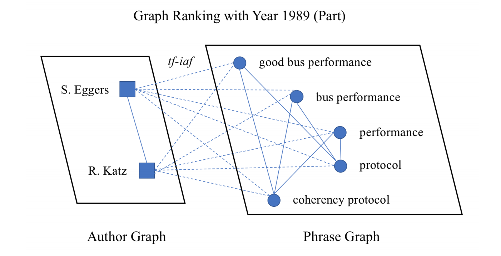

# Identifying Emergent Research Trends by Key Authors and Phrases

This is the repository for the paper [Identifying Emergent Research Trends by Key Authors and Phrases](https://www.comp.nus.edu.sg/~kanmy/papers/identifying-emergent-research.pdf) (COLING 2018). It includes the implementation of the ETD-MGR model illustrated by the paper, as well as some sample outputs to demonstrate how to interpret the results.

## Requirements

Code is written in Python 2.7; it also requires scikit-learn (0.18), numpy (1.13), gensim (3.1), networkx (1.11), NLTK (3.2), and Keras (2.1). 

In addition, you'll need the pretrained Word2Vec [model](https://code.google.com/archive/p/word2vec/) from Google (i.e. the GoogleNews-vectors-negative300.bin file).

## Data

The main experiments are carried out based on the ACM Digital Library dataset, with the metadata state dated 11, Sept, 2015. Raw data is consolidated in XML format, and due to copyright reason we do not release it here. If you want to learn more about the raw dataset, or want to test out our code based on the actual ACM data, please email the authors of the paper, either Shenhao Jiang by **jiangshenhao@gatech.edu**, or Prof. Min-Yen Kan by **kanmy@comp.nus.edu.sg**; once receiving the request, we'll send you a folder of sample XML files from the dataset so you can gain some insights on the raw data.

Nevertheless, in order to help researchers have a better understanding of the code, we will provide some sample outputs/temporary files from the model. Please refer to *Section Results/Analysis* below for details.

## Run the Code

Running the code is simple, you may put the 2 Python files into the folder of the extracted dataset (all these settings can be changed in the code), and perform
```
python doubleGraphExtract.py
```
to extract the noun phrases from the corpora, and calculate their MGR scores in each year. This part of the logic can be illustrated by the following plot:



and you may find the corresponding explanation in Section 3.1 of the paper.

This will generate several files (to be found in ./process/ dir) to be used in later stage:
- doublegraph-NPs.txt <br>
The file with the extracted NPs and their MGR score in each year;
- doublegraph-vocab.txt <br>
The file with the vocabulary list and the *tf-idf* value of each word;
- top-authors-NPs.txt <br>
The file with the top ranked authors in each year.

Following this, you can perform 
```
python doubleGraphPredict.py
```
to generate the predicted top-ranking phrases.

## Results/Analysis

The final result can be found in dir ./process/resultXXX.txt, with the XXX indicating the configurations, for instance, the prediction window size and the weighting coefficient (please refer to Section 3.3 of the paper for more details). This repo has included a sample result file: ./process/result-20.txt. The format of the file is as follows:

| Predicting Year 1980 | actual? | predict? |
| :---: | :---: | :---: |
| allocator | + | + |
| allocator | + | + |
| iterations | + | + |
| termination | + | + |
| probabilities | + | - |
| ranges | - | + |

Each line of the file contains a noun phrase, with 2 symbols indicating whether this phrase is an actual trending phrase or predicted one. If it's associated with "++", it means this phrase is an actual trending phrase and has been successfully captured by our system. Therefore the average recall@n can be calculated by number of "++" / number of phrases. More discussion of the result can be found in Section 4.2 of the paper.

In addition to the sample result file, we have also included a sample doublegraph-NPs.txt in the repo. We hope researchers can get a better understanding of what our system is doing; the format of the file is:

| phrase | score in Year 1 | score in Year 2 | ... |
| :---: | :---: | :---: | :---: |
| system design | 0 | 0.0009827 | ... |
| software development process | 0 | 0.0003723 | ... |

This file is generated by the first step (doubleGraphExtract.py), obtaining the MGR score for each phrase in each year, and essentially what our model is doing is: using the scores from the first 3 consecutive years to predict the 4th one, i.e. x4 = f(x1, x2, x3). We rank the phrases based on their actual and predicted scores, and then for each year you'll find the top phrases, as shown by the first table.

## Misc. and Acknowledgement

If you have queries about the use of the code, or the explanation in the paper, feel free to email the authors found on the first page of the paper.

Similar to the paper, this research/project is supported in part by the National Research Foundation, Singapore, and completed with the National University of Singapore (NUS).